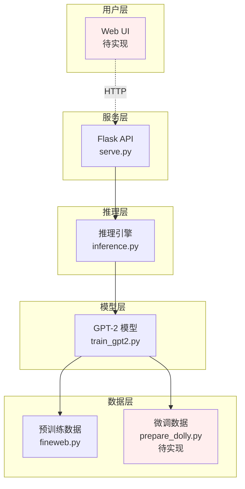
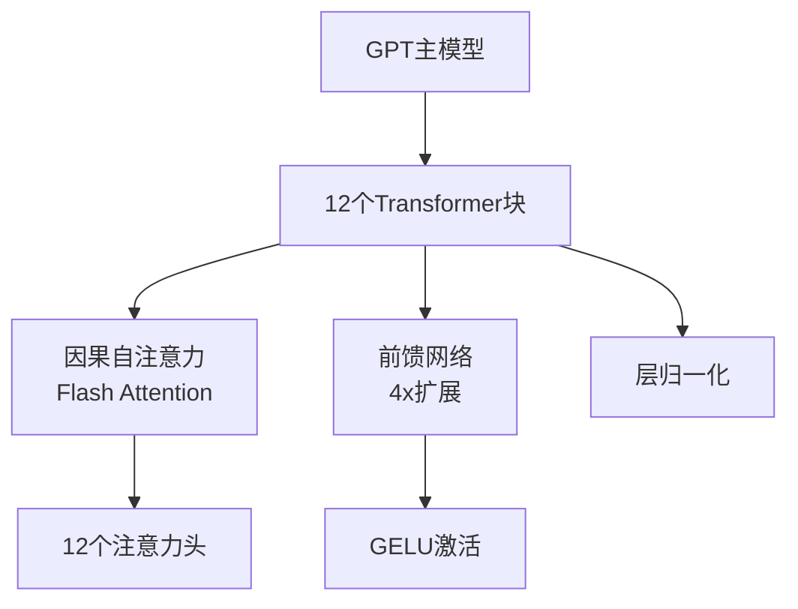
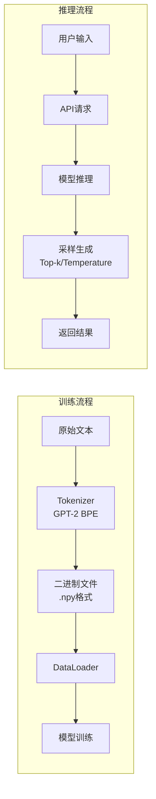

# nano-GPT 架构文档

## 系统概览



## 核心组件

### 模型架构 (train_gpt2.py)



**关键参数**：
- 模型大小：124M参数
- 词汇表：50,257 tokens
- 嵌入维度：768
- 上下文长度：1024

### 数据流



## 项目结构

```
nano-gpt/
├── model/
│   ├── train_gpt2.py      # 模型定义+预训练
│   └── finetune_dolly.py  # 指令微调(待实现)
├── data_prep/
│   ├── fineweb.py         # 预训练数据处理
│   └── prepare_dolly.py   # 微调数据处理(待实现)
├── platform/
│   ├── serve.py           # Flask API服务
│   └── inference.py       # 推理接口
├── eval/
│   └── hellaswag.py       # 模型评估
├── docs/                  # 项目文档
└── log/                   # 训练日志和检查点
```

## 关键特性

### 训练优化
- **混合精度训练** (AMP)
- **梯度累积**
- **分布式训练** (DDP)
- **检查点续训**

### 推理优化
- **KV缓存**
- **Top-k采样**
- **温度控制**

## 当前状态

✅ **已完成**
- GPT-2基础模型实现
- 预训练流程
- 推理引擎
- API服务框架

❌ **待实现**
- Dolly数据集准备
- 指令微调脚本
- Web前端界面
- 完整的错误处理

## 技术栈

- **深度学习**: PyTorch
- **分词器**: tiktoken
- **Web框架**: Flask
- **数据处理**: NumPy, datasets

---
*最后更新: 2025-07-11*