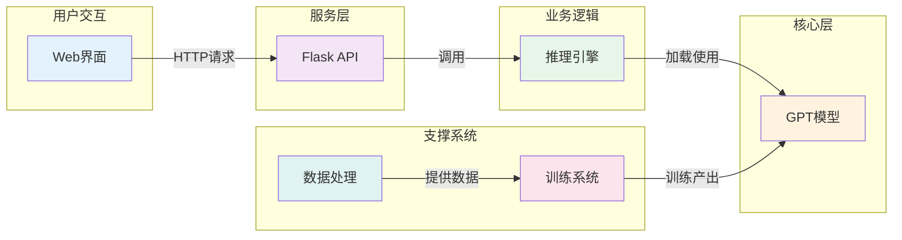
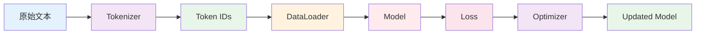

# 项目架构设计文档

## 项目概述
本项目基于 Andrej Karpathy 的 nanoGPT 实现，旨在构建一个完整的指令型语言模型系统。通过使用 Dolly 15k 数据集进行微调，将基础的 GPT-2 模型转变为能够理解和执行指令的智能助手，并提供用户友好的 Web 界面。

## 系统架构图

```mermaid
graph TB
    subgraph "前端界面层"
        A1[index.html<br/>用户界面]
        A2[app.js<br/>交互逻辑]
        A3[style.css<br/>界面样式]
    end
    
    subgraph "API 服务层"
        B1[serve.py]
        B2[Flask App]
        B3["/generate 端点<br/>文本生成"]
        B4["/health 端点<br/>健康检查"]
        B5[请求验证与错误处理]
        B1 --> B2
        B2 --> B3
        B2 --> B4
        B2 --> B5
    end
    
    subgraph "推理引擎层"
        C1[inference.py]
        C2[load_model_from_checkpoint]
        C3[generate_text]
        C4[采样策略<br/>temperature, top-k]
        C5[Tokenizer 集成]
        C1 --> C2
        C1 --> C3
        C1 --> C4
        C1 --> C5
    end
    
    subgraph "模型层"
        D1[GPT 模型架构]
        D2[GPT<br/>主模型类]
        D3[Block<br/>Transformer块]
        D4[CausalSelfAttention<br/>自注意力机制]
        D5[MLP<br/>前馈网络]
        D6[GPTConfig<br/>模型配置]
        D1 --> D2
        D1 --> D3
        D1 --> D4
        D1 --> D5
        D1 --> D6
    end
    
    subgraph "训练系统层"
        E1[train_gpt2.py<br/>预训练脚本]
        E2[数据加载]
        E3[训练循环]
        E4[梯度累积]
        E5[混合精度]
        E6[检查点保存]
        E1 --> E2
        E1 --> E3
        E1 --> E4
        E1 --> E5
        E1 --> E6
        
        F1[finetune_dolly.py<br/>指令微调脚本]
        F2[Dolly数据加载]
        F3[指令模板处理]
        F4[微调超参数]
        F5[断点续训]
        F1 --> F2
        F1 --> F3
        F1 --> F4
        F1 --> F5
    end
    
    subgraph "数据处理层"
        G1[fineweb.py<br/>预训练数据]
        H1[prepare_dolly.py<br/>指令数据准备]
        H2[下载Dolly 15k]
        H3[格式化为指令对]
        H4[数据清洗与过滤]
        H5[训练/验证集划分]
        H1 --> H2
        H1 --> H3
        H1 --> H4
        H1 --> H5
    end
    
    %% 层级之间的连接
    A1 & A2 & A3 -.->|HTTP/JSON| B1
    B1 -.-> C1
    C1 -.-> D1
    D1 -.-> E1
    D1 -.-> F1
    E1 -.-> G1
    F1 -.-> H1
    
    classDef frontend fill:#e1f5fe,stroke:#01579b,stroke-width:2px
    classDef api fill:#f3e5f5,stroke:#4a148c,stroke-width:2px
    classDef inference fill:#e8f5e9,stroke:#1b5e20,stroke-width:2px
    classDef model fill:#fff3e0,stroke:#e65100,stroke-width:2px
    classDef training fill:#fce4ec,stroke:#880e4f,stroke-width:2px
    classDef data fill:#e0f2f1,stroke:#004d40,stroke-width:2px
    
    class A1,A2,A3 frontend
    class B1,B2,B3,B4,B5 api
    class C1,C2,C3,C4,C5 inference
    class D1,D2,D3,D4,D5,D6 model
    class E1,E2,E3,E4,E5,E6,F1,F2,F3,F4,F5 training
    class G1,H1,H2,H3,H4,H5 data
```

### 系统架构分层视图

## 核心模块说明

### 1. 模型架构模块 (`train_gpt2.py` 中的模型定义)

#### GPT 类
- **职责**：主模型类，管理整个 Transformer 架构
- **主要组件**：
  - Token embeddings
  - Position embeddings
  - Transformer blocks 堆叠
  - 最终的语言模型头

#### Block 类
- **职责**：单个 Transformer 块
- **组成**：
  - LayerNorm (前置归一化)
  - Multi-head self-attention
  - LayerNorm
  - Feed-forward network (MLP)
  - 残差连接

#### CausalSelfAttention 类
- **职责**：实现因果自注意力机制
- **特点**：
  - 使用 Flash Attention 优化
  - 支持多头注意力
  - 因果掩码确保自回归特性

### 2. 训练系统模块

#### `train_gpt2.py`
- **功能**：基础模型预训练
- **关键特性**：
  - 分布式数据并行 (DDP)
  - 混合精度训练 (AMP)
  - 梯度累积
  - 学习率调度
  - 检查点保存与恢复

#### `finetune_dolly.py`（待实现）
- **功能**：指令微调
- **关键差异**：
  - 更小的学习率
  - 指令格式化模板
  - 不同的数据加载逻辑
  - 保留预训练权重

### 3. 数据处理模块

#### `fineweb.py`
- **功能**：处理预训练数据
- **数据源**：FineWeb 数据集
- **输出**：分词后的二进制文件

#### `prepare_dolly.py`（待实现）
- **功能**：准备指令微调数据
- **数据源**：Dolly 15k from Hugging Face
- **处理流程**：
  1. 下载数据集
  2. 格式化为指令-回答对
  3. 分词处理
  4. 保存为训练格式

### 4. 推理系统模块

#### `inference.py`
- **功能**：模型推理接口
- **核心方法**：
  - `load_model_from_checkpoint()`: 加载训练好的模型
  - `generate_text()`: 文本生成
  - 支持多种采样策略

### 5. Web 服务模块

#### `serve.py`
- **框架**：Flask
- **端点**：
  - `POST /generate`: 文本生成
  - `GET /health`: 健康检查
- **特性**：
  - JSON 请求/响应
  - 参数验证
  - 错误处理

### 6. 前端界面模块

#### `static/index.html`（待实现）
- **功能**：用户界面
- **组件**：
  - 输入文本框
  - 参数调节控件
  - 生成按钮
  - 结果显示区域

#### `static/app.js`（待实现）
- **功能**：前端交互逻辑
- **职责**：
  - 处理用户输入
  - 调用后端 API
  - 显示生成结果
  - 错误处理

## 数据流程

### 训练阶段数据流

### 推理阶段数据流

## 关键设计决策

### 1. 模型选择
- **基础模型**：GPT-2 (124M)
- **原因**：
  - 训练成本可控
  - 架构经典且稳定
  - 社区支持良好

### 2. 微调策略
- **方法**：全参数微调
- **数据集**：Dolly 15k
- **原因**：
  - 数据质量高
  - 覆盖多种指令类型
  - 开源免费

### 3. 技术栈
- **后端**：Python + PyTorch + Flask
- **前端**：原生 HTML/CSS/JavaScript
- **原因**：
  - 简单直接
  - 易于理解和修改
  - 依赖最小化

### 4. 部署方案
- **方式**：单机部署
- **服务**：Flask 开发服务器（可升级到 Gunicorn）
- **考虑**：
  - 项目规模适中
  - 便于调试
  - 可扩展性好

## 扩展性设计

### 1. 模型扩展
- 支持加载不同大小的模型
- 可切换不同的 checkpoint
- 易于集成新的生成策略

### 2. 数据扩展
- 模块化的数据处理脚本
- 支持多种数据格式
- 易于添加新数据集

### 3. 功能扩展
- API 设计遵循 RESTful 原则
- 前后端分离便于独立升级
- 预留了批处理、流式输出等接口

### 4. 部署扩展
- 支持 Docker 容器化
- 可集成到 Kubernetes
- 支持水平扩展

## 性能考虑

### 1. 训练性能
- 使用混合精度训练加速
- 梯度累积减少显存使用
- 支持多 GPU 并行

### 2. 推理性能
- KV-cache 优化
- 批处理支持
- 模型量化（可选）

### 3. 服务性能
- 异步请求处理
- 连接池管理
- 缓存机制（可选）

## 安全性设计

### 1. 输入验证
- 长度限制
- 内容过滤
- 参数范围检查

### 2. API 安全
- CORS 配置
- 速率限制
- API 密钥（可选）

### 3. 模型安全
- 输出长度限制
- 敏感内容过滤（可选）

## 监控与日志

### 1. 训练监控
- Loss 曲线记录
- 验证集性能
- 资源使用情况

### 2. 服务监控
- 请求响应时间
- 错误率统计
- 资源占用

### 3. 日志管理
- 分级日志系统
- 日志轮转
- 错误追踪

## 总结
本架构设计遵循模块化、可扩展、易维护的原则，将整个系统分为清晰的层次，每个模块职责单一，接口明确。这种设计不仅满足当前的项目需求，还为未来的功能扩展和性能优化留下了充足的空间。

---
最后更新：2025-07-10